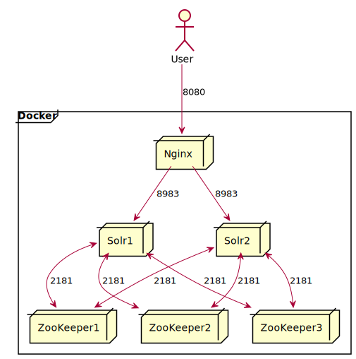

# japan_address

郵便番号データ

## Source

https://www.post.japanpost.jp/zipcode/download.html

## Solr

[Solr](https://lucene.apache.org/solr/) で検索クラスタを構築します。



## Start Cluster

`ZooKeeper`, `Solr`, `Nginx` のクラスタを起動します。
起動が完了すると `http://localhost:8080/solr/` にブラウザでアクセスするとSolrの管理画面が表示されます。

```bash
$ docker-compose up -d
```

## Upload configsets

`Solr` のCollectionを作成するためのConfigsetsをUploadします。Configsetsにはschemaが含まれます。

```bash
$ cd configsets
$ zip -r japan_address.zip *
$ curl -X POST -H "Content-Type:application/octet-stream" --data-binary @japan_address.zip \
  "http://localhost:8080/solr/admin/configs?action=UPLOAD&name=japan_address"
```

## Create collection

Solrの管理画面からCollectionを作成します。
左サイドメニューの `Collections` から `Add Collection` を選択し、項目を入力してCollectionを作成します。

|項目|説明|入力例|
|:--|:--|:--|
|name|Collection名|japan_address|
|config set|ZooKeeperにある `solrconfig.xml` や `schema.xml` などの設定の集合 | Upload configsets でアップロードした `japan_address` |
|numShards|全体のshardの数|1|
|replicationFactor| 1 shardに対するreplicaの数 | 2 |

## Import data

郵便番号のCSVデータをインポートします。

```bash
$ curl -X POST -H 'Content-type: text/csv; charset=utf-8' --data-binary @ken_all.csv \
  'http://localhost:8080/solr/japan_address/update?commit=true'
```

[Solrの管理画面](http://localhost:8080/solr/#/japan_address/query) からクエリを実行することでインポートされたデータを確認できます。
